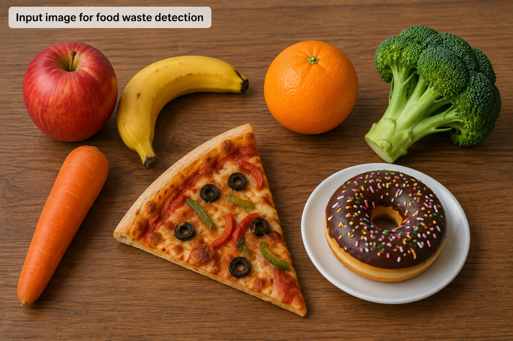
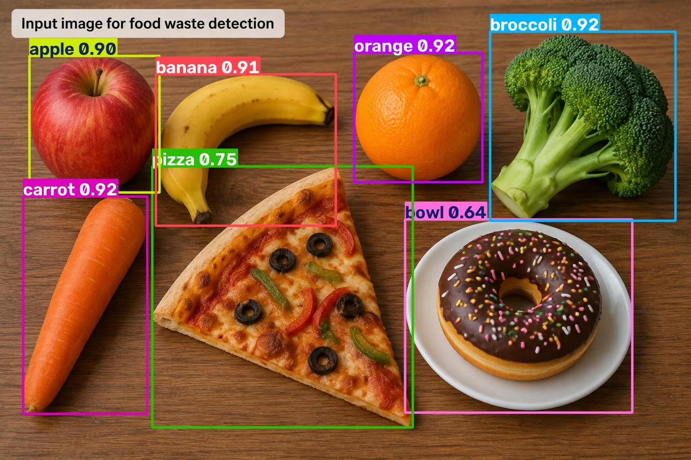

# AI-Based Food Waste Detection

A reproducible computer-vision proof-of-concept for AI-assisted food-waste detection, inspired by AI-based smart-bin systems for food-waste monitoring and reduction.

## Project Motivation

Food waste reduction requires not only measuring how much waste is discarded, but also identifying the type and patterns of discarded food.

This project develops a computer-vision prototype that explores how object detection can serve as one component of an AI-based smart-bin system.

## Research Concept

The proposed workflow is:

```text
Image acquisition
        ↓
Object detection
        ↓
Food-item identification
        ↓
Waste categorisation
        ↓
Quantitative analysis
        ↓
Identification of waste patterns
        ↓
Evaluation of interventions
```

## Objectives

- Detect food-related objects in images using computer vision.
- Estimate the type and number of detected food items.
- Explore how computer-vision outputs can support automated food-waste monitoring.
- Provide a reproducible computational foundation for future smart-bin integration.

## Methods

The prototype is implemented in Python using a pretrained YOLO object-detection model.

The repository includes:

- Python-based detection code
- Configurable confidence threshold
- Food-related class filtering
- Object counting
- Bounding-box visualisation
- CSV export of detection results
- Automated execution through GitHub Actions

## Computer Vision Pipeline

The current implementation uses a pretrained YOLO object-detection model to demonstrate the food-detection component of the proposed smart-bin workflow.

The pipeline:

1. Loads an input image.
2. Runs YOLO object detection.
3. Filters detected objects to food-related classes.
4. Counts detected food items.
5. Generates an annotated output image.
6. Exports detection results as a CSV file.

## Example Input

The input image used for the proof-of-concept:



## Example YOLO Output

The corresponding YOLO detection output:



The output demonstrates object detection using bounding boxes and confidence scores.

The accompanying `food_sample_detections.csv` file contains the detected food classes, confidence scores, and bounding-box coordinates.

## Detection Results

For the example image, the pretrained YOLO model detected six food-related objects:

| Food Class | Confidence |
|------------|------------|
| broccoli   | 91.55%     |
| orange     | 91.55%     |
| carrot     | 91.51%     |
| banana     | 91.17%     |
| apple      | 89.65%     |
| pizza      | 74.72%     |

The detection results are also exported to `food_sample_detections.csv`, including the detected class, confidence score, and bounding-box coordinates.

These results demonstrate the feasibility of the proposed computer-vision component as a starting point for an AI-assisted food-waste monitoring system.

## Reproducibility

The project is designed to be reproducible.

Dependencies are listed in `requirements.txt`, while the detection workflow is automatically executed through GitHub Actions.

The automated workflow is:

```text
Checkout repository
        ↓
Set up Python
        ↓
Install dependencies
        ↓
Run YOLO food detection
        ↓
Generate image + CSV outputs
        ↓
Upload detection results
```

## Important Scope

This repository is a research proof-of-concept rather than a complete physical smart-bin system.

The current implementation uses a pretrained general-purpose object-detection model and is not presented as a food-waste-specific model trained on a dedicated dataset.

The purpose is to establish and demonstrate the computational pipeline that can later be extended with food-waste-specific data and models.

## Future Development

Possible extensions include:

- Training on a dedicated food-waste dataset
- Food-waste-specific object detection
- Multi-object detection
- Food-waste quantity estimation
- Temporal analysis of waste patterns
- Integration with a camera-equipped smart bin
- Deployment on edge hardware
- Analysis of interventions designed to reduce food waste

## Repository Structure

```text
ai-food-waste-detection/
│
├── src/
│   └── detect_food.py
│
├── food_sample.png
├── food_sample_detected.jpg
├── food_sample_detections.csv
├── requirements.txt
├── README.md
│
└── .github/
    └── workflows/
        └── detection.yml
```

## Author

Leila Eskandari
